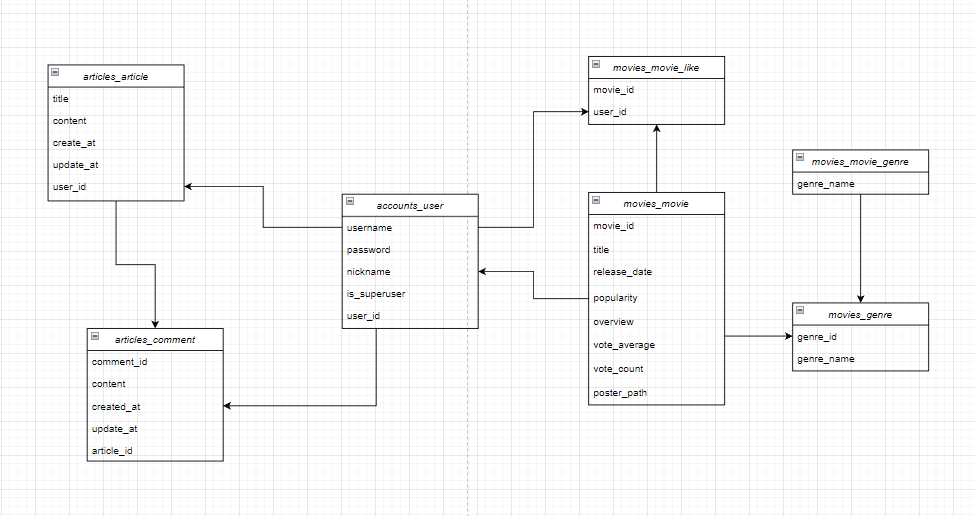
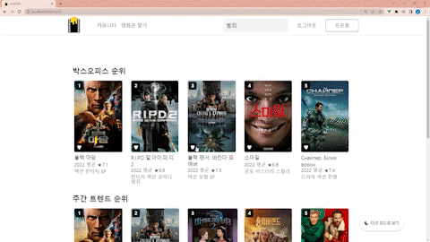
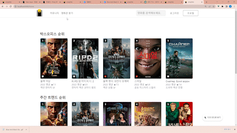
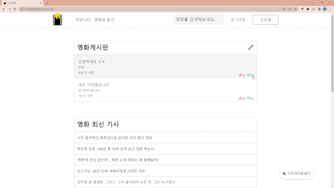
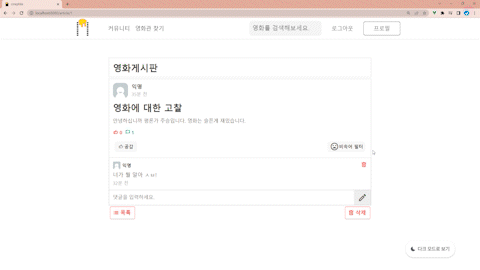

### 🥇프로젝트 소개

### 

### 🤝팀원 정보 및 업무 분담 내역

| 이름  | 업무 분담 내역                                                                                          |
| --- | ------------------------------------------------------------------------------------------------- |
| 전동인 | - 팀장 - 전체적인 프로젝트 진행 사항 점검 - 프론트엔드 주도 및 백엔드 서브 - DB에서 데이터를 받아와 프론트엔드 기능 구현 및 디버깅, 테스트  |
| 박주승 | - 프론트엔드  - 프론트엔드 기능 구현, 프론트엔드 디자인 정교화                                                          |
| 장준호 | - 백엔드 - DB 모델링, 백엔드 데이터 로직 작성 및 Movies, Articles, Accounts 구조화                                 |

### 

### 💻 필수 요구사항

| No. | 구분             | 기능                                                                                                                                                                     | 구현 정도(⭐⭐⭐⭐⭐) |
| --- | -------------- | ---------------------------------------------------------------------------------------------------------------------------------------------------------------------- | ------------ |
| 1   | 영화 데이터         | 최소 50개 이상 존재                                                                                                                                                       | ⭐⭐⭐⭐⭐        |
| 1   |                | 데이터는 fixtures를 사용하여 언제든 load 될 수 있도록 준비                                                                                                                                | ⭐⭐⭐⭐⭐        |
| 2   | 영화 추천 알고리즘 | - 박스오피스 순위 - 주간트렌드 순위 - 장르 추천                                                                                                                                  | ⭐⭐⭐⭐⭐        |
| 3   | API            | TMDB API를 이용                                                                                                                                                           | ⭐⭐⭐⭐⭐        |
| 4   | 커뮤니티           | 유저 간 소통 할 수 있는 커뮤니티 기능 구현                                                                                                                                              | ⭐⭐⭐⭐⭐        |
| 5   | README         | 1. 팀원 정보 및 업무 분담 내역 2. 목표 서비스 구현 및 실제 구현 정도 3. 데이터베이스 모델링 4. 영화 추천 알고리즘에 대한 기술적 설명 5. 서비스 대표 기능에 대한 설명 6. 배포 서버 URL(배포했을 경우) 7. 기타(느낀 점, 후기 등) | ⭐⭐⭐⭐⭐        |

### 

### ⚒️기술 스택

 
 
 

 
 

### 🏗데이터 베이스 모델링(ERD)

### 📝영화 추천 알고리즘

- 박스오피스 순위
  
  - /movie/popular를 이용하여 가장 인기 있는 영화로 구성
  
  - 당일 기준으로 하여 최신 개봉작을 내림차순하여 분류

- 주간트렌드 순위
  
  - /trending/movie/week, /trending/movie/top_rated를 이용하여 매주 최신화 되는 영화로 구성
  
  - 당일 기준으로 하여 최신 개봉작을 내림차순하여 분류

- 장르 추천
  
  - 모든 장르를 평점과 개봉일 순으로 내림차순하여 분류 후
  
  - 19개 장르 중 임의로 하나를 선택해 제시

### 🎨 서비스 대표 기능

* 건조한 눈 때문에 영화 검색이 힘드시다구요!? Don't worry about that!!
  
  야간 사용시 여러분의 안구 건강을 위한 다크모드/라이트모드 전환 기능!!
  
  

* 회원가입이 어렵다구요?! Don't worry about that!!
  
  간편한 소셜 로그인이 가능해요!
  
  
  
  

* 추천이 아니고 내가 원하는 영화를 직접 찾고 싶다구요?! Don't worry about that!!

검색과 영화 상세 페이지, 그리고 유튜브 영상을 통해 정보 파악이 용이합니다!

그리고 영화가 마음에 들었다면 좋아요를 통해 마이페이지에 저장 가능합니다!!

* 영화에 대한 자유로운 대화를 위해 커뮤니티 기능에 중점을 두었습니다.
  
  자유로운 게시글 작성 가능
  
  

    댓글 작성시 익명으로 거침없는 자기 주장 피력!!

    건강한 커뮤니티 문화를 위한 최신 HOT 비속어 필터링!!

       

* 당장 영화를 보러 가고 싶다구요!?  Don't worry about that!!
  
  GPS 위치를 기반으로 근처 영화관의 정보를 알려줍니다!!

### 🌼주요 이슈 및 해결 방안

| 개요                                   | 해결방안                                       |
| ------------------------------------ | ------------------------------------------ |
| carousel, swipe 등 라이브러리 호환성 문제 발생    | 팀원들의 nvm 버젼 통합(16.18.0)                    |
| 댓글 추가시 스크롤 다운 구현 및 화면이 가끔 그려지지 않는 오류 | 어싱크 어웨이를 사용하고, 함수를 세부적으로 나눠 각자 구동하는 방식을 채용 |
| 깃랩 푸시 및 서버 오류                        | 깃허브로 서버 투트랙 사용                             |

### 🤔느낌점

* 전동인  
  '계획한대로 되는 것은 없다. 그럼에도 챙길 건 챙기자.' 이 말이 개발에 임하는 저의 첫 마음가짐이였다. 결론적으로 얻을건 확실히 얻었다. 소셜 로그인 같은 경우 Django DB에 대한 개발 노하우가 적어서 회원등록까진 진행하지 못했지만, 토큰을 가져오고 사용자 정보를 카카오로부터 가져오는 것까지는 얼추 성공했다. 그외 카카오맵이나 웹크롤링은 내가 표현하고자하는 정보까지는 보여주는데 성공했고, 다크모드나 욕설 필터링도 나름의 고생끝에 만족스러운 정도의 구현에 성공했다. 반대로 놓치부분은 css와 디자인이다. 이 부분은 개발자 역량에서 논외로 보는 시선도 있지만, 이번 프로젝트를 통해서 사용자에게 보여진다는게 새삼 얼마나 중요한지 타 프로젝트를 진행하는 동료들과 비교하면서 느끼게 되었다. 그래서 이 부분은 확실히 보완하려한다.

* 박주승
  
  1학기 마지막 평가이자 개발자로 입문하는 기로에 있는 이 시점에서 페어 두분과 프로젝트를 시작하게 되었습니다. 우선 장고에 대한 이해도가 떨어져 프론트 엔드 쪽 vue를 구현하게 되었습니다. 1학기 동안 배웠던 js, html, css를 다시 다루다보니 잊었던 내용도 새록새록 기억나고, 수동적으로 배웠던 것을 다시 능동적으로 결과물을 생산하기 위해 노력하다보니 학습 효과도 좋았습니다. 또한 ui,ux, 프론트엔드에 대한 생각도 재고할 수 있었습니다. 하지만 css만 한창 할 때는 이게 과연 개발 프로젝트가 맞나라는 생각을 할 정도로 스트레스도 있었으나, 동료들의 도움으로 극복 할 수 있어서 정말 감사하게 생각하고 있습니다. 이번 프로젝트로 저의 실력에서 부족한 부분 뿐만 아니라 프로젝트 기간 저의 약했던 마인드 셋, 시간 관리, 체력 관리 등 총체적으로 점검하고 파악할 수 있었습니다. 이를 기반으로 다음 프로젝트때 좋은 자세로 임하고, 성장하는 개발자가 되자고 다짐했습니다.

* 장준호
  
  생애 첫 프로젝트를 해본 결과 나 혼자의 힘으로는 프로젝트를 구현하기 굉장히 어렵다는 것을 알았다. Django DB에 데이터를 쌓을때부터 어려움을 호소하여 Google과 동료들의 힘을 많이 빌렸다. Django DB에 데이터를 쌓기 위해 직적 .json 생성을 하고, 생성한 .json 파일에 우리 서비스에 필요한 것들을 담기위해 커스텀하는 과정들이 처음에는 신박하게 느껴졌다. 프로젝트를 진행하며 막히는 부분이 많아 어려움이 많았지만 충분히 고민하고 동료들과 소통한 결과 많은 어려움을 해결 할 수 있어 협업의 중요함을 많이 느낀 프로젝트 였습니다. 제 역량이 부족해 고생한 동료들에게 너무 미안함과 감사함을 전하고 싶습니다!
